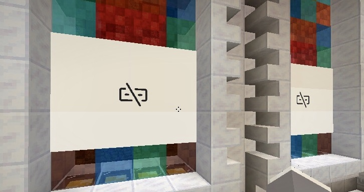

# EusScreenMirroring Client
**Simple client for casting your screen to Minecraft server with EusScreenMirroring installation**


## Start Mirroring
You can specify connection parameters by either the two following ways.
### 1) Commandline Arguments
#### Arguments:
```
--address | -a : Server address (without port)
--port | -p    : EusScreenMirroring port (EusScreenMirroring default: 17211)
--width | -w   : Display window width
--height | -h  : Display window height
--id | -i      : Mirror ID (Get by using /screenmirroring list)
--password | -d: Mirror password (Get by using /screenmirroring list)

Optional arguments:
--screenshotRefreshInterval      : Time interval between screenshot refreshes (in milliseconds)
--mouseCoordinateRefreshInterval : Time interval between mouse location refreshes (in milliseconds)
```
#### Startup Command Example:
```shell
java -jar screenmirroringclient.jar -a server.eumc.cc -p 17211 -w 4 -h 3 -i 1 -d 524288
```
↓
```
Done! Type `help` for command help.
> _
```

### 2) Interactive
#### Startup Command Example:
```shell
java -jar screenmirroringclient.jar
```
↓
```
** No arguments specified. You can use --help for argument list. **
Address: server.eumc.cc
Port (default: 17211): 17211
Mirror width (default: 4): 4
Mirror width (default: 3): 3
Mirror ID: 1
Password: 
Done! Type `help` for command help.
> _
```
> **Notice:** password will not echo when you are typing


## Interactive Console
Type `help` or `?` for command list.

Currently, there are two commands available:
```
pause(p): (Un)pause screen mirroring
quit(q):  Request server showing disconnect screen and then exit
```

### Pause / Unpause
Type `pause` or `p`, screen mirroring will be paused, and a request to show `disconnect screen` will be sent. Type `pause` again to continue casting your screen.

By default, the `disconnect screen` looks like this:


### Quit
Type `quit` or `q`, and the client will require the server to show `disconnect screen` on your Screen Mirror, then it will exit.

If you do not want a `disconnect screen` being shown after you stop screen mirroring, simply press `Ctrl + C`.


## Credit
- `org.bukkit.map.MapPalette`: https://github.com/Bukkit/Bukkit/blob/master/src/main/java/org/bukkit/map/MapPalette.java